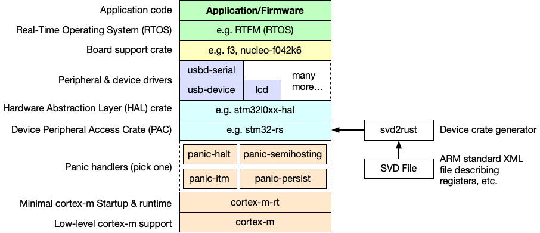

= rust-stm32-playground =

[WARNING]
.STMF446RE
====
This project is configured for the STMF446RE. If you are using another MCU and board please review all parameters and configure properly.
====

== Ecosystem ==

.Embedded Rust ecosystem for STM32 <<_4,[4]>>

== Toolchain ==

.Install rustup
[source, bash]
----
curl --proto '=https' --tlsv1.2 -sSf https://sh.rustup.rs | sh
----

.Install Rust toolchain and ARM target.
[source, bash]
----
rustup update
rustup target add thumbv7em-none-eabihf
----

Some additional tools:

. https://github.com/probe-rs/probe-rs/tree/master/cargo-flash[cargo-flash] - This crate provides a cargo subcommand to flash ELF binaries onto ARM chips.
. https://github.com/probe-rs/probe-rs/tree/master/cargo-embed[cargo-embed] - Provides a cargo subcommand to work with embedded targets.
. https://github.com/rust-embedded/cargo-binutils[cargo-binutils] - Cargo subcommands to invoke the LLVM tools shipped with the Rust toolchain.

.Install some additional useful tools.
[source, bash]
----
cargo install cargo-flash cargo-embed cargo-binutils
----

=== udev ===

. Install libudev `sudo apt install libudev-dev`.
. Download the file https://probe.rs/files/69-probe-rs.rules[69-probe-rs.rules] and place it in `/etc/udev/rules.d`.
. Run udevadm control --reload to ensure the new rules are used.
. Run udevadm trigger to ensure the new rules are applied to already added devices.

== Flash ==

.Flash binary to target.
[source, bash]
----
cargo flash --chip stm32f446re --release
----

== Debug ==

. Create a Run/Debug configuration in CLion.
+

. Build and flash the binary (debug build) to target and open RTT and GDB.
+
[source, bash]
----
cargo embed --chip stm32f446re
----

. Start the configured debugging session in CLion by pressing the little 'bug' button.
+

== References ==

[[_1]] [1] https://github.com/rust-embedded/awesome-embedded-rust[Curated list of awesome embedded Rust resources]

[[_2]] [2] https://medium.com/digitalfrontiers/rust-on-a-stm32-microcontroller-90fac16f6342[Rust on an STM32 microcontroller by Marco Amann]

[[_3]] [3] https://jonathanklimt.de/electronics/programming/embedded-rust/rust-on-stm32-2/[Rust on STM32: Getting started by Jonathan Klimt]

[[_4]] [4] https://craigjb.com/2019/12/31/stm32l0-rust/[STM32L0 Rust Part 1 - Getting Started by Craig Bishop]

[[_5]] [5] https://apollolabsblog.hashnode.dev/series/stm32f4-embedded-rust-hal[STM32F4 with Embedded Rust at the HAL]

[[_6]] [6] https://www.st.com/content/ccc/resource/technical/document/user_manual/98/2e/fa/4b/e0/82/43/b7/DM00105823.pdf/files/DM00105823.pdf/jcr:content/translations/en.DM00105823.pdf[STM32 Nucleo-64 User manual]

[[_7]] [7] https://www.st.com/resource/en/reference_manual/rm0390-stm32f446xx-advanced-armbased-32bit-mcus-stmicroelectronics.pdf[STM32F446 Reference manual]

[[_8]] [8] https://www.st.com/resource/en/programming_manual/pm0214-stm32-cortexm4-mcus-and-mpus-programming-manual-stmicroelectronics.pdf[STM32 Cortex-M4 Programming manual]
